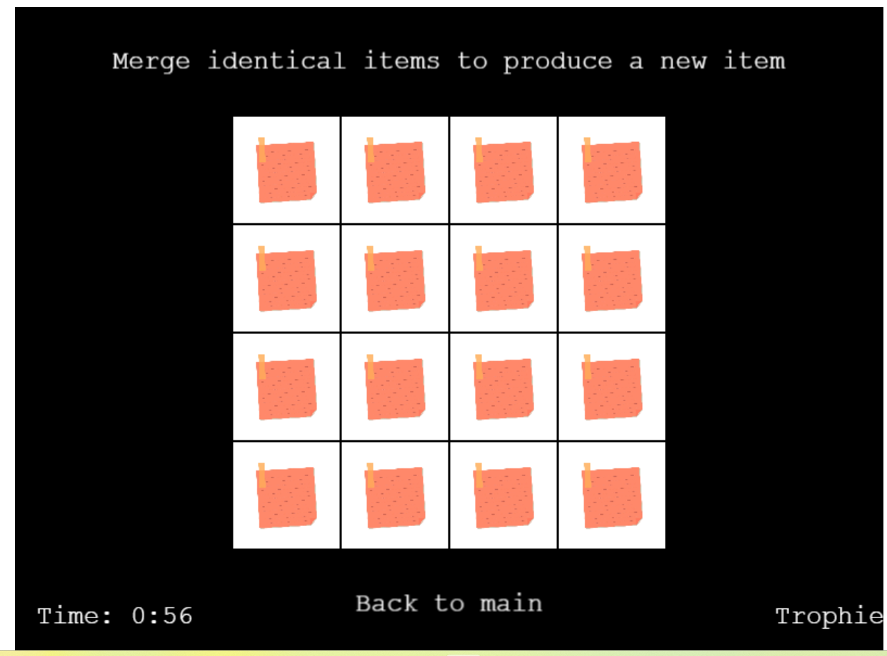
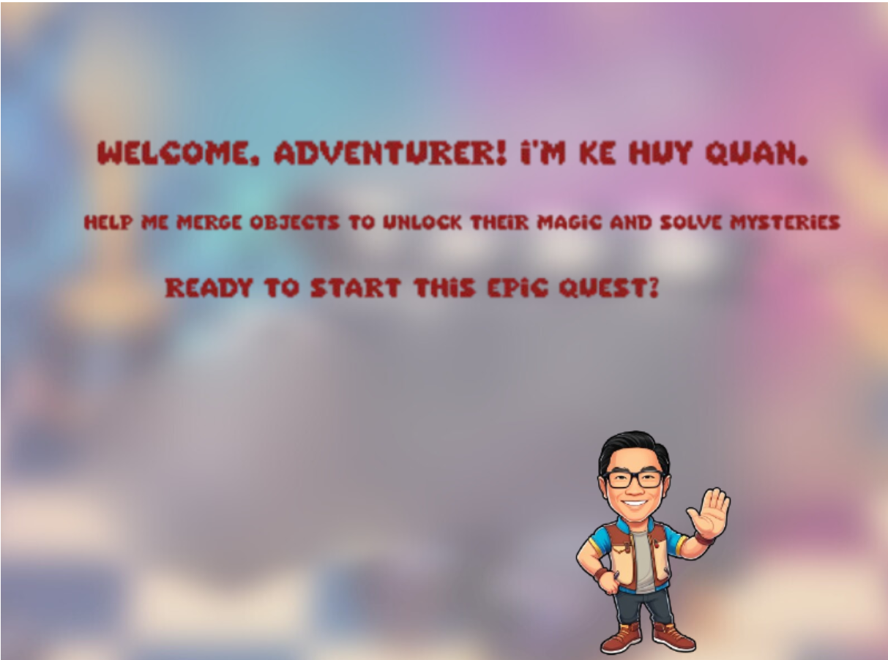
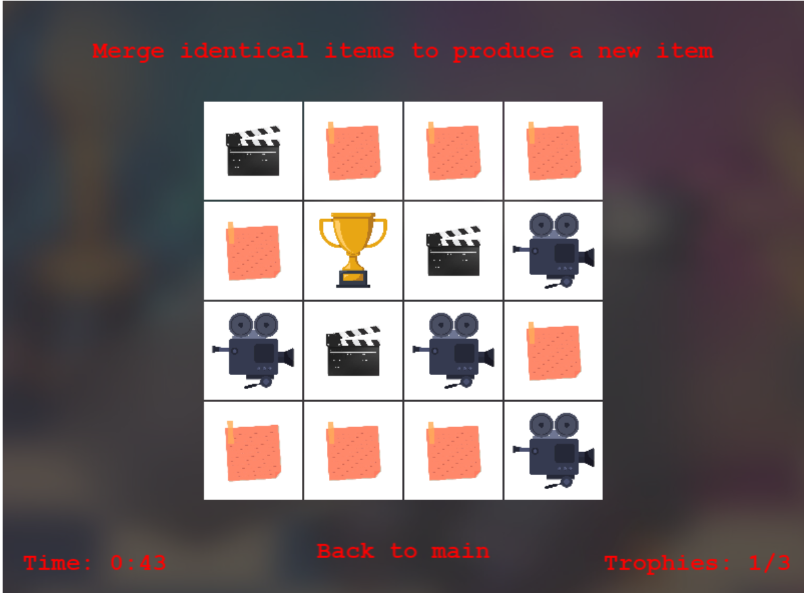
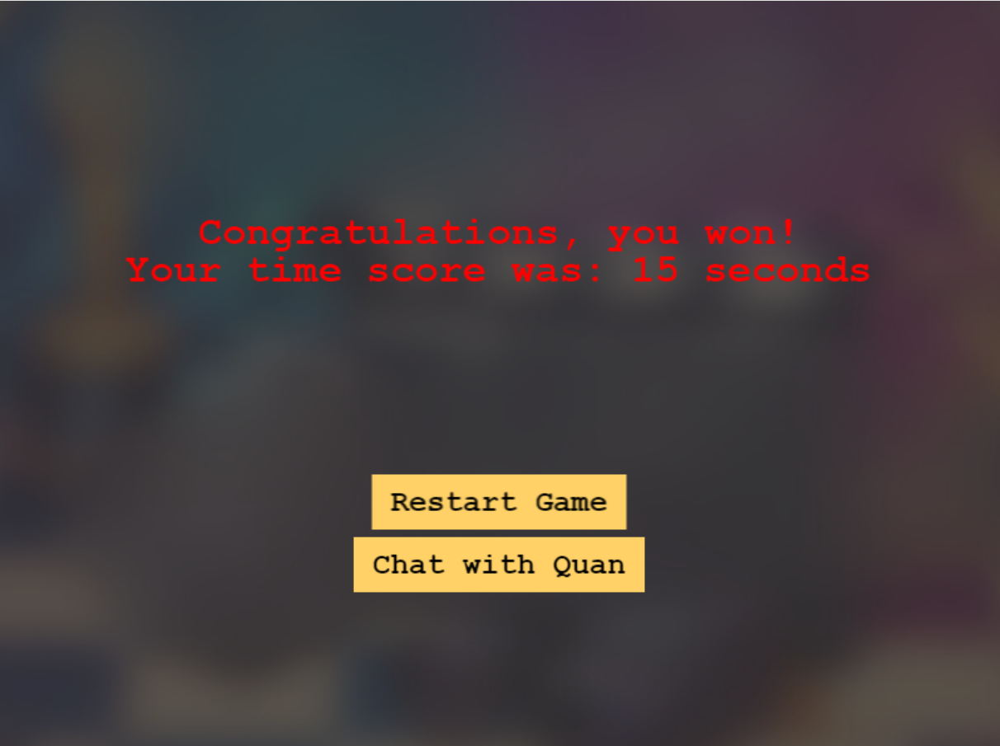
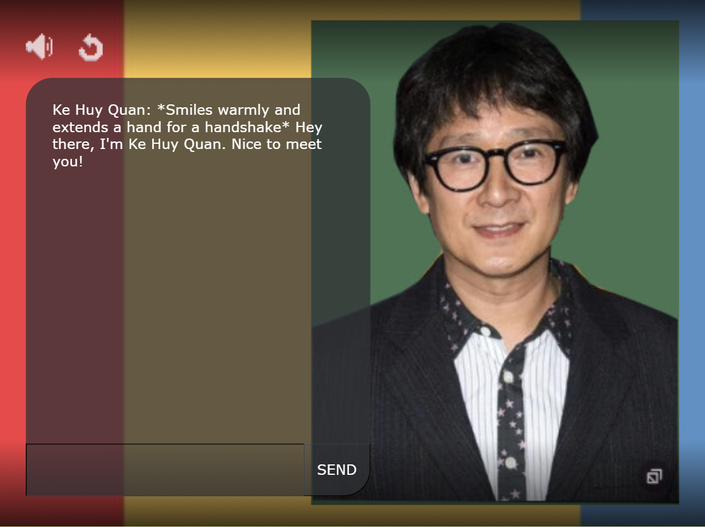

# ke huy quan - Merging-Game

## Overview

"Interactive Art: The Journey of an Unknown Artist" is an educational and immersive merging game that explores the life of a refugee artist who rises to prominence, ultimately winning an Oscar. This game aims to raise awareness and empathy for the refugee experience through interactive storytelling, visually engaging gameplay, and merging mechanics that symbolize growth and transformation.

## Internship Project

This game is developed as part of an internship project with the primary goal of creating an impactful and informative experience using Rosebud AI and the Phaser game framework. The project merges technical skill development with creative storytelling to produce a meaningful educational tool.

## Features

- **Educational Content**: Discover the life journey of a refugee artist and the obstacles they overcame.
- **Merging Gameplay**: Combine images to uncover key events in the artist's life and progress through the narrative.
- **Artistic Design**: Experience a visually rich environment inspired by modern art and cinematic achievements.
- **Story-Driven Experience**: Unlock scenes and learn about pivotal moments in the artist's journey.

## Technology Stack

- **Rosebud AI**: Used for generating assets and enhancing the creative process.
- **Phaser**: A powerful framework for developing 2D games, used to build and run the game.

## Live Link

[Play the game online](https://github.com/sridharaniruddha/collective-game/)

## Live on RosebudAI

[Play on RosebudAI](https://play.rosebud.ai/games/e8c92f4d-132a-42f6-a44d-7264d6cb96dd)

## Usage

The following images show the game's appearance and functionality:

## License

This project is licensed under the MIT License. See the [LICENSE](LICENSE) file for more details.

## Collaborators

- [Aniruddha](https://github.com/sridharaniruddha)
- [Vicky](https://github.com/Vickysug)
- [Constantin](https://github.com/Costea47)

## Acknowledgements

- Special thanks to the Rosebud AI team for their support and resources.
- Inspired by the resilience and creativity of refugees around the world.
